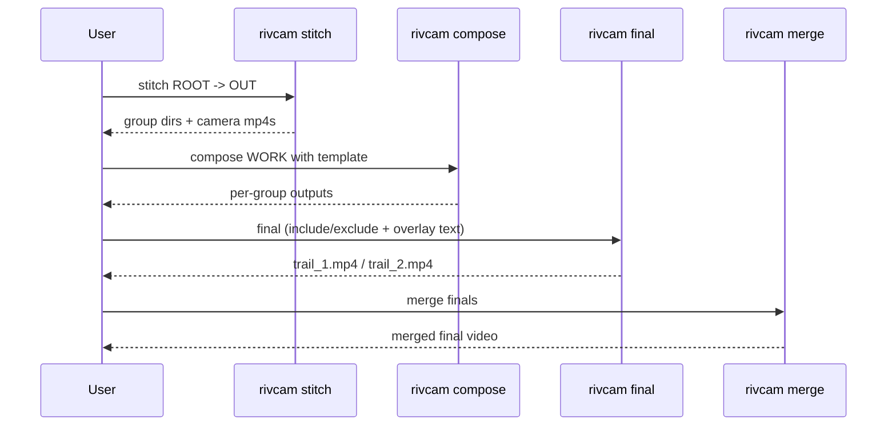

# Rivcam Guide (High-Level)

This document explains what `rivcam` offers, how the pipeline fits together, and how to run it end-to-end from raw clips to merged finals.

## What Rivcam Offers

`rivcam` is a focused CLI pipeline for:

- parsing Rivian clip names into normalized clip records,
- grouping clips by timeline gaps,
- stitching per-camera timelines with overlap trimming,
- composing per-group videos from a JSON template,
- building filtered/labeled finals from selected groups,
- merging multiple final videos into one output.

## End-to-End Pipeline

```mermaid
flowchart LR
    A["Raw clip dump (.mp4)"] --> B["rivcam stitch<br/>parse + normalize + group + trim overlap"]
    B --> C["Group directories<br/>group_XX or Rivian_*"]
    C --> D["rivcam compose<br/>template-driven overlays"]
    D --> E["Per-group outputs<br/>(default: composite.mp4)"]
    E --> F["rivcam final<br/>select groups + optional text overlay"]
    F --> G["Final outputs<br/>(trail_1.mp4, trail_2.mp4, etc.)"]
    G --> H["rivcam merge<br/>concat many finals"]
    H --> I["Merged final deliverable"]
```



## Command Surface

| Command | Purpose | Typical Output |
|---|---|---|
| `rivcam stitch` | Parse clips, group by timeline, stitch camera files per group | `<renders>/<root>/<group>/<camera>.mp4` |
| `rivcam compose` | Render per-group template composition | `<group>/<group-output-name>` |
| `rivcam final` | Concat selected group outputs into one final (+ optional drawtext) | `<root>/<final-name>.mp4` |
| `rivcam merge` | Concat already-rendered final videos | `<root>/<out>.mp4` |
| `rivcam all` | Run stitch then compose | stitched + composited outputs |

## Template Settings and Usage

`rivcam compose` uses a JSON template (for example: `scripts/default_template.json`).

### Template Structure

```json
{
  "canvas": { "w": 1920, "h": 1080 },
  "layers": [
    {
      "key": "frontCenter",
      "w": 640,
      "h": 540,
      "x": 640,
      "y": 0
    }
  ]
}
```

### Layer Fields

- `key`: camera key (`frontCenter`, `rearCenter`, `sideLeft`, `sideRight`, `gearGuard`).
- `w`, `h`: target layer size.
- `x`, `y`: final overlay position on canvas.
- `transpose`: optional ffmpeg transpose value (for 90-degree rotations).
- `mirror`: optional horizontal flip.
- `stretch_w`: optional pre-crop stretch width.
- `pan_x`: optional crop x offset after stretch.
- `auto_crop_y`: optional crop y offset after stretch.

### Transform Order

For each layer, transforms run in this order:

1. `transpose` (if set)
2. `mirror` (if true)
3. `scale` (to `stretch_w x h` if `stretch_w` is set, else `w x h`)
4. `crop` to `w x h` using `pan_x`/`auto_crop_y`
5. `overlay` at (`x`, `y`)

### Why This Matters

- Use `pan_x` to shift content inside a layer without moving the layer box.
- Use `x` to move the entire layer box on the output canvas.
- Keep template layout concerns in template JSON, not in final concat.

## Step-by-Step: Raw Clips to Grouped, Composited, Final, Merged

This is the recommended flow for a full-drive workflow.

### 1) Define paths

```bash
ROOT=/Volumes/fuckyoumean/rivfootage
OUT=/Volumes/fuckyoumean/rivscan_grouped_output
WORK="$OUT/$(basename "$ROOT")"
TEMPLATE=/Users/kyledarling/Documents/Projects/Rivian/scripts/default_template.json
```

### 2) Stitch raw clips into timeline groups

```bash
./.venv311/bin/rivcam stitch "$ROOT" --renders "$OUT" --gap 60 --cleanup-on-failure
```

Result:

- group folders under `"$WORK"` (for example `group_01`, `group_02`, ...),
- per-camera stitched files in each group.

### 3) Build per-group composites from template

Reference: see [Template Settings and Usage](#template-settings-and-usage).

```bash
./.venv311/bin/rivcam compose "$WORK" \
  --template "$TEMPLATE" \
  --group-output-name composite.mp4 \
  --no-final \
  --encoder auto \
  --cleanup-on-failure
```

This creates per-group outputs only (no combined final yet).

### 4) Generate a filtered/labeled final from groups

Example: exclude groups 1, 5, 6 and burn text overlay.

```bash
./.venv311/bin/rivcam final "$WORK" \
  --input-name composite.mp4 \
  --exclude-group 1 \
  --exclude-group 5 \
  --exclude-group 6 \
  --overlay-text "YOLO" \
  --final-name final_excluding_1_5_6_yolo.mp4
```

### 5) Create multiple finals with different labels

Example:

```bash
./.venv311/bin/rivcam final "$WORK" --include-group 2 --include-group 3 --overlay-text "Trail 1" --final-name trail_1.mp4
./.venv311/bin/rivcam final "$WORK" --include-group 4 --overlay-text "Trail 2" --final-name trail_2.mp4
```

### 6) Merge multiple finals into one deliverable

```bash
./.venv311/bin/rivcam merge "$WORK" \
  --input trail_1.mp4 \
  --input trail_2.mp4 \
  --out trails_combined.mp4
```

## Process Diagram (Command-Level)



## Practical Notes

- `--cleanup-on-failure` is enabled by default across commands.
- `rivcam final` only concatenates per-group files matching `--input-name`.
- `rivcam merge` concatenates explicit final files so users do not need manual ffmpeg commands.
- Hardware encode fallback behavior remains in composition flow (`auto` strategy).

## Quick Troubleshooting

- "No per-group `<name>.mp4` files found":
  - verify `--input-name` in `rivcam final` matches what `rivcam compose --group-output-name` generated.
- "No space left on device":
  - free output disk space, then rerun command.
- Missing camera files in a group:
  - composer fills missing layers with black by design.
